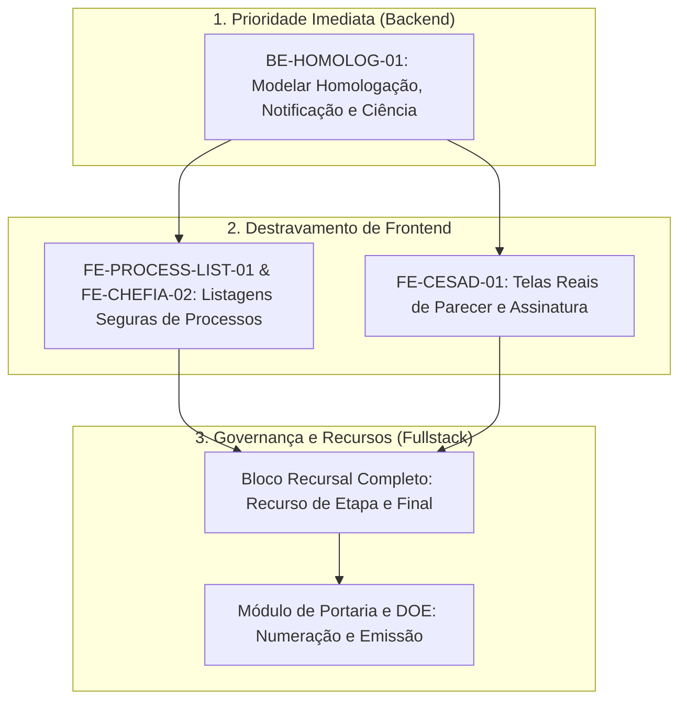

# SADEP — Roadmap Consolidado: Estado Atual e Próximos Passos

**Status:** Documento de Planejamento Operacional e Estratégico

**Escopo:** Inventário completo do que já foi desenvolvido (Backend, Frontend e Workflow) e o detalhamento estruturado do que precisa ser implementado

**Referência Principal:** Nivelamento de código e documentações operacionais (`backend/active.md` e `frontend/active.md`)

---

## 1. Introdução e Objetivo

Este documento estabelece o **Roadmap Consolidado do SADEP**, servindo como ponte de visibilidade entre o estado atual da base de código (o que está funcional, testado e validado) e o backlog de tarefas futuras (o que ainda precisa ser construído para a entrega total do MVP).

O objetivo é fornecer uma visão clara de dependências, garantindo que o desenvolvimento siga a ordem processual correta e evite a criação isolada de interfaces sem o devido suporte de contratos no backend.

---

## 2. O que JÁ FOI Desenvolvido (Entregas Consolidadas)

A base atual do SADEP já possui o núcleo de workflow, segurança e fundações de avaliação firmemente implementados. Abaixo está o inventário do que está pronto:

### 2.1. Backend & Workflow (Domínio e API)

- _Progressão Formal de 4 Etapas (`BE-FLOW-4STAGE-01`):_
  - Materialização estrutural de 4 etapas avaliativas obrigatórias (`ETAPA_1` a `ETAPA_4`) para o Caso 2.
  - Lógica robusta de ciclo de vida (etapas ativas vs. futuras), impedindo que etapas futuras recebam documentos ou assinaturas indevidas.
  - Implementação da ação `COMPLETE_CURRENT_STAGE`, que encerra formalmente a etapa ativa, aciona a guarda documental (exigindo avaliações e pareceres devidamente assinados) e abre sequencialmente a próxima etapa.
- **Autenticação e Sessões Seguras (`BE-ARCH-01E`):**
  - Modelo completo de sessão no banco (`UserSession`), suporte a Refresh Token opaco via cookies `HttpOnly`, rotação transacional de tokens e proteção contra reuso (revogação em cascata).
- **Autorização Contextual e Governança da CESAD (`BE-CESAD-AUTH` e `BE-DOC-CESAD-SIGN`):**
  - Proteção de endpoints baseada em atribuições ativas da comissão (`CesadStageAssignment`), garantindo que apenas a comissão correta atue no processo.
  - Fluxo de reatribuição e substituição formal de comissões (`BE-CESAD-ASSIGN-REPLACE-01`).
  - Assinatura colegiada do Parecer CESAD de Etapa, exigindo a conclusão das assinaturas de todos os membros obrigatórios.
- **Parecer Conclusivo Final da CESAD (`BE-CESAD-FINAL-01`):**
  - Modelo funcional (`CesadFinalOpinion`), regras de elegibilidade (disponível apenas após a conclusão das 4 etapas) e garantias de unicidade.
  - Preparação e coleta de assinaturas colegiadas finais.
  - Ação de transição `SEND_TO_HOMOLOGATION`, que envia formalmente o processo para a mesa da Autoridade Homologadora após a assinatura completa do parecer final.

### 2.2. Frontend (Interface e Aplicação Web)

- **Autenticação e Sessão (`features/auth`):**
  - Tela de login totalmente funcional com JWT, tratamentos de invalidamento de sessão, retry automático de `401` e refresh silencioso.
- **Workspace de Leitura CESAD (`features/cesad` / `FE-CESAD-READ-01`):**
  - Leitura consolidada real integrada ao endpoint de backend. Exibe dados do processo, do servidor, histórico da etapa, lista de documentos oficiais e cronograma de assinaturas.
  - O parecer da etapa é exibido em modo somente leitura quando retornado pelo backend.
- **Componentes de Processo (`features/process`):**
  - Fundações visuais para linha do tempo da etapa (Stage Timeline), histórico do processo, painel de status e caixas de avisos.
- **Qualidade e Testes Frontend (`FE-TEST-01`):**
  - Ampla cobertura de testes unitários para guards de autenticação, estados operacionais institucionais e validação de cópia (copywriting).

---

## 3. O que PRECISA Ser Feito (Backlog e Pendências)

Para que o SADEP atinja sua plena capacidade operacional e atenda 100% do rito administrativo, as seguintes frentes precisam ser desenvolvidas, respeitando a ordem estrita de dependências:

### 3.1. Backend & Contratos (Fundações Prioritárias)

1. **[PRIORIDADE MÁXIMA] `BE-HOMOLOG-01` — Fluxo de Homologação, Notificação e Ciência:**
   - A ponte `SEND_TO_HOMOLOGATION` já existe. Falta implementar as APIs e a lógica de decisão da Autoridade Homologadora (homologar ou devolver para ajuste), a geração automatizada da Notificação Pessoal e o endpoint para o registro formal de Ciência do servidor.
2. **`BE-SEC-03` — Extensão da Autorização Contextual CESAD:**
   - Expandir as barreiras de segurança para cobrir o acesso aos documentos finais, atos de homologação e artefatos gerados na reta final do processo.
3. **Módulo de Publicação e Portaria (`BE-PORT-01` / Futuro):**
   - Modelar a entidade `PublicationOrdinance`, suporte a portarias individuais e coletivas, geração de numeração sequencial transacional (sem repetição ou colisão) e estrutura de dados copiável para o sistema do Diário Oficial (DOE).
4. **Bloco Recursal Completo (`BE-APPEAL-01` / Futuro):**
   - Implementar as APIs para abertura de recurso de etapa (com travamento automático após 5 dias da ciência), geração do despacho preliminar da CESAD, resposta da chefia (com abertura de Avaliação Substitutiva no caso de reavaliação) e o rito de Recurso Final à Autoridade Homologadora.

### 3.2. Frontend (Dependente de Contratos Backend)

O desenvolvimento das telas a seguir está expressamente condicionado à existência prévia dos contratos e endpoints seguros no backend:

1. **`FE-PROCESS-LIST-01` e `FE-CHEFIA-02` — Listagens Autenticadas de Processos:**
   - Implementar a listagem real dos processos vinculados ao perfil logado (chefia, servidor ou comissão), removendo os fallbacks demonstrativos e a inserção manual de IDs.
2. **`FE-CESAD-01` — Workspaces Ativos da CESAD:**
   - Conectar as telas reais para elaboração de pareceres de etapa, elaboração do Parecer Conclusivo Final, disparo da preparação de assinaturas e interface de coleta de assinaturas colegiadas.
3. **Desenvolvimento dos Módulos em Scaffold (`.gitkeep`):**
   - A base frontend possui vários diretórios estruturais vazios (apenas reservados) em `apps/frontend/src/features/`. Eles precisarão ser construídos do zero assim que o backend fornecer as fundações:
     - `features/homologacao-autoridade/` (Conectar à API da Autoridade Homologadora);
     - `features/notificacoes-ciencia/` (Tela de visualização de notificação e clique de ciência do servidor);
     - `features/assinaturas-eletronicas/` (Integração de provedores, como GOV.BR);
     - `features/avaliacoes/` e `features/autoavaliacao/` (Workspaces ativos de preenchimento);
     - `features/painel-gerencial-cesad/` e `features/cesad-comissao/`.

---

## 4. Matriz de Priorização e Fases do Roadmap

Para manter o ritmo de entrega com a máxima integridade e segurança, o roadmap operacional está dividido nas seguintes fases sequenciais:

|         Fase          | Foco Operacional                  | Principais Tarefas                                                                                                                                | Impacto de Negócio                                                                                 |
| :-------------------: | :-------------------------------- | :------------------------------------------------------------------------------------------------------------------------------------------------ | :------------------------------------------------------------------------------------------------- |
| **Fase 1 (Atual)** | **Fechamento do Fluxo Principal** | • `BE-HOMOLOG-01` (Homologação, Notificação e Ciência) • `BE-SEC-03` (Segurança residual)                                                      | Finaliza a espinha dorsal do processo no backend, cobrindo o rito do início ao fim.                |
|      **Fase 2**       | **Destravamento de Interfaces**   | • `FE-PROCESS-LIST-01` e `FE-CHEFIA-02` (Listagens reais) • `FE-CESAD-01` (Telas ativas da CESAD) • Workspaces de Avaliação e Autoavaliação | Substitui os dados demonstrativos no frontend por integrações reais e seguras com a API.           |
|      **Fase 3**       | **Defesa e Publicação**           | • APIs e Telas do Bloco Recursal (Recurso de Etapa e Final) • Módulo de Portaria e Integração DOE                                              | Garante o direito de defesa (contraditório) ao servidor e prepara os atos para publicação oficial. |
|      **Fase 4**       | **Hardening e Ecossistema**       | • Assinaturas Externas (GOV.BR) • `BE-AUDIT-AUTH-01` (Auditoria persistida de auth) • Cadastro e Gestão de Comissões CESAD                  | Eleva o nível de segurança, conformidade e integração institucional do sistema.                    |

---

## 5. Regra de Governança para Desenvolvedores

> [!CAUTION]
>
> 1. **Nenhuma tarefa frontend de produto (telas ativas de comissão, avaliações da chefia, autoavaliação ou notificações) deve ser iniciada de forma isolada** sem que o respectivo contrato backend esteja implementado, testado e validado.
> 2. Tarefas só podem ser marcadas como concluídas nos roadmaps operacionais (`backend/active.md` ou `frontend/active.md`) após validação funcional completa e aprovação humana explícita.
