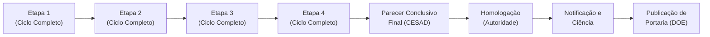
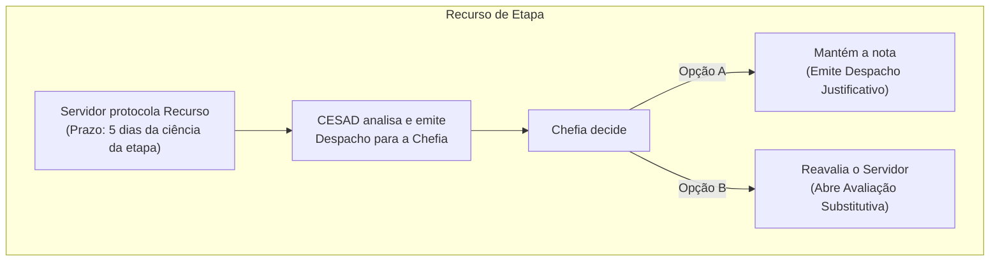

# SADEP — Guia Conceitual e Visão Geral do Sistema

**Status:** Aprovado para referência institucional e de negócio

**Escopo:** Guia explicativo completo sobre o funcionamento do SADEP, perfis de usuários, etapas do processo, regras de homologação e recursos administrativos

**Público-Alvo:** Gestores, servidores, comissões de avaliação e auditores (abordagem não técnica)

---

## 1. O que é o SADEP e qual o seu Objetivo?

O **SADEP** (Sistema de Avaliação de Desempenho de Estágio Probatório) é uma plataforma governamental/institucional dedicada a gerenciar, formalizar e automatizar o processo de avaliação dos servidores públicos durante os seus três anos de estágio probatório.

> [!IMPORTANT]
> O SADEP **não é um simples sistema de formulários ou um repositório para guardar arquivos em PDF**.
> Trata-se de um sistema de processo administrativo digital baseado em fluxos de trabalho (workflow) e transições obrigatórias de estado, concebido para garantir **segurança jurídica absoluta, imutabilidade dos atos após assinatura e rastreabilidade total para auditoria**.

### 1.1. Pilares Filosóficos e Arquiteturais

1. **Orientação a Estados:** O processo possui um caminho de etapas bem delimitado. O sistema não permite avançar ou pular fases sem que a etapa atual esteja integralmente completa e devidamente assinada.
2. **Imutabilidade Jurídica:** Uma vez que um documento (como uma avaliação ou parecer) recebe a assinatura eletrônica, **ele não pode ser alterado sob nenhuma hipótese**. Se for necessária uma retificação ou reavaliação, o sistema conduzirá um novo ato formal (substitutivo), preservando o histórico da versão anterior intacto.
3. **Determinismo e Prazos Rígidos:** O sistema controla automaticamente os prazos legais, exibindo contadores e bloqueando ações (como a abertura de recursos) assim que o período estipulado por lei expira.
4. **Auditoria Geral:** Cada ação de relevância no sistema registra com precisão o usuário, o perfil utilizado, a data e hora exatas e o impacto no rito processual.

---

## 2. Perfis de Usuários (Contas e Atores)

O processo de estágio probatório no SADEP é essencialmente colaborativo e interliga quatro atores principais, cada um com papéis, direitos e deveres estritamente delimitados:

| Perfil                          | Papel no Sistema            | Responsabilidades Principais                                                                                                                                                                                                               |
| :------------------------------ | :-------------------------- | :----------------------------------------------------------------------------------------------------------------------------------------------------------------------------------------------------------------------------------------- |
| **Servidor-Estagiário**         | O Avaliado                  | • Preencher e assinar sua Autoavaliação a cada etapa • Assinar (dar ciência) na avaliação emitida pela Chefia • Visualizar pareceres e notificações • Protocolar recursos formais em caso de discordância                         |
| **Chefia Imediata**             | O Gestor / Avaliador Direto | • Elaborar e assinar a avaliação de desempenho do servidor a cada etapa • Analisar e assinar a Autoavaliação preenchida pelo servidor • Apresentar despachos em resposta aos recursos interpostos                                    |
| **CESAD** _(Comissão Especial)_ | O Órgão Colegiado           | • Inspecionar os relatórios e avaliações de cada etapa • Debater, elaborar e assinar (colegiadamente) o Parecer de Etapa • Elaborar e assinar o Parecer Conclusivo Final • Processar e intermediar a análise inicial dos recursos |
| **Autoridade Homologadora**     | O Decisor Final             | • Receber o processo concluído após o Parecer Final da CESAD • Tomar a decisão oficial de Homologação (validação legal) • Assinar a Notificação de Resultado e a Portaria final                                                      |

> [!NOTE]
> A CESAD pode contar com o auxílio do perfil de _Assistente de Comissão_ para apoiar na organização, leitura e triagem dos processos, mas a elaboração oficial e a assinatura dos pareceres são atribuições exclusivas dos **Membros da CESAD**.

---

## 3. A Estrutura do Processo: O Rito de 4 Etapas ("Caso 2")

O modelo processual central em operação no SADEP atende ao chamado **Caso 2** (regra aplicável a servidores com ingresso após 31/07/2015).

Neste modelo, o servidor possui **1 único Processo Administrativo** durante todo o seu estágio probatório. Este processo é composto por **4 etapas avaliativas internas obrigatórias**, que ocorrem sucessivamente ao longo dos anos.

### 3.1. O Ciclo de Vida Obrigatório de Cada Etapa

As Etapas 1, 2, 3 e 4 funcionam de maneira independente, mas conectadas ao mesmo processo principal. Para que uma única etapa seja considerada legalmente e documentalmente concluída, ela exige a execução obrigatória de cinco passos formais:

1. **Avaliação da Chefia:** A chefia imediata acessa o sistema, preenche os critérios e pontuações aplicáveis ao desempenho do servidor, salva e efetua a assinatura eletrônica do documento.
2. **Assinatura do Servidor na Avaliação:** O servidor é avisado, acessa seu perfil, lê a avaliação emitida pela chefia e assina o documento para formalizar que tomou ciência.
3. **Autoavaliação do Servidor:** O próprio servidor preenche um formulário estruturado de autoavaliação, refletindo sobre o seu desempenho no período, e em seguida assina.
4. **Assinatura da Chefia na Autoavaliação:** A chefia imediata visualiza a autoavaliação submetida pelo servidor e aplica sua assinatura para fechar esse ciclo documental.
5. **Parecer CESAD da Etapa:** Em conjunto da avaliação da chefia e da autoavaliação do servidor, a comissão (CESAD) analisa a consistência dos dados, redige o parecer técnico relativo àquela etapa e assina o documento de forma conjunta (colegiada).

---

## 4. O Fechamento do Estágio Probatório: Parecer Final e Homologação

Após o cumprimento exitoso das quatro etapas regulares, o processo entra em sua fase conclusiva, que prepara o rito para oficializar a estabilidade (ou reprovação) do servidor. Esta fase possui regras estritas de encadeamento:

### 4.1. Parecer CESAD Conclusivo Final

Assim que a 4ª etapa é encerrada e tem seu parecer de etapa assinado, o sistema habilita a CESAD a elaborar o **Parecer Conclusivo Final**.
Este documento agrega todo o histórico do processo: consolida as notas das quatro etapas, calcula a pontuação geral final, emite o conceito definitivo e redige a recomendação final de aprovação ou reprovação para a Autoridade Homologadora.

### 4.2. A "Trava" de Homologação

O SADEP incorpora uma trava de segurança jurídica automatizada: a Autoridade Homologadora **só recebe o processo em sua fila e só consegue assinar a homologação se e somente se**:

- As quatro etapas foram integralmente cumpridas e assinadas;
- Os pareceres de todas as etapas foram emitidos;
- O Parecer Conclusivo Final da CESAD foi plenamente assinado por todos os membros obrigatórios.

> [!CAUTION]
> Nenhuma notificação final ou portaria pode ser emitida antes da Homologação da Autoridade, impedindo qualquer atropelo processual ou vício de nulidade.

### 4.3. Notificação Pessoal e Ciência

Após a assinatura da Homologação, o sistema gera automaticamente uma **Notificação Pessoal** oficial a partir de um template institucional.
O servidor recebe o alerta, acessa o painel, visualiza seu resultado final devidamente formalizado e clica para assinar o **Registro de Ciência** (ato de confirmação oficial de recebimento).

### 4.4. Portaria e Diário Oficial

Com a ciência concluída (ou após os prazos recursais), o SADEP gera a **Portaria** para publicação no Diário Oficial do Estado (DOE). A portaria pode ser emitida individualmente ou de forma coletiva (reunindo uma tabela de vários servidores homologados), controlando uma numeração sequencial rigorosa e única.

---

## 5. Garantia de Defesa e Recursos Administrativos

O SADEP respeita os princípios constitucionais da ampla defesa e do contraditório. Caso o servidor discorde de notas, conceitos ou pareceres, o sistema gerencia com precisão dois fluxos recursais:

### 5.1. Recurso por Etapa

- **Cabimento:** Contra a nota ou o parecer emitido em qualquer uma das quatro etapas.
- **O Prazo:** **5 dias** a contar da data em que o servidor visualiza/toma ciência do resultado da etapa. O sistema exibe um cronômetro regressivo e, ao fim dos 5 dias, o botão de recurso é sumariamente desabilitado.
- **A Tramitação:**
  1. O servidor escreve suas razões no sistema e protocola o recurso (direcionado à CESAD).
  2. A CESAD faz a análise preliminar e gera um despacho encaminhando a controvérsia à Chefia Imediata.
  3. A Chefia Imediata tem a obrigação de responder, escolhendo entre duas ações:
     - **Manter a avaliação:** Redige um despacho justificando por que a nota está correta.
     - **Reavaliar o servidor:** O sistema inicia uma **Avaliação Substitutiva**. Trata-se de uma nova avaliação que passará pelo fluxo normal de assinaturas (chefia e servidor).
- **Regra de Histórico (Auditoria):** A reavaliação **nunca apaga a avaliação anterior contestada**. A avaliação antiga permanece intocada no banco de dados com o status de _Superada/Invalidada_, garantindo total transparência e rastro de auditoria.

### 5.2. Recurso Final

- **Cabimento:** Contra o resultado final do estágio probatório (após a homologação e notificação da Autoridade Homologadora).
- **O Prazo:** **5 dias** a contar da visualização/ciência da notificação final pelo servidor.
- **A Tramitação:** Este recurso é dirigido diretamente à **Autoridade Homologadora** e tem efeito suspensivo sobre a emissão da portaria até que a análise e a decisão recursal definitiva sejam formalizadas.

---

## 6. Síntese do Fluxo Macro de Estados

Para acompanhar visualmente o andamento de qualquer processo no SADEP, o sistema transita entre os seguintes macroestados ao longo do estágio probatório:

1. `EM_AVALIACAO` — Fases ativas de preenchimento de notas e autoavaliações.
2. `AGUARDANDO_ASSINATURA` — Avaliações geradas aguardando a assinatura da chefia ou do servidor.
3. `ASSINADO` — Documentos do ciclo completados com as assinaturas necessárias.
4. `EM_ANALISE_CESAD` — Etapa sob relatoria e redação de parecer pela comissão.
5. `PARECER_EMITIDO` — Parecer (de etapa ou final) concluído e com assinaturas do colegiado.
6. `HOMOLOGADO` — Decisão oficial da Autoridade Homologadora assinada.
7. `NOTIFICADO` — Notificação gerada e enviada ao perfil do servidor.
8. `CIENTE` — Servidor registrou sua ciência formal na notificação.
9. `ENCERRADO` — Portaria emitida e ciclo de estágio probatório concluído com sucesso.
